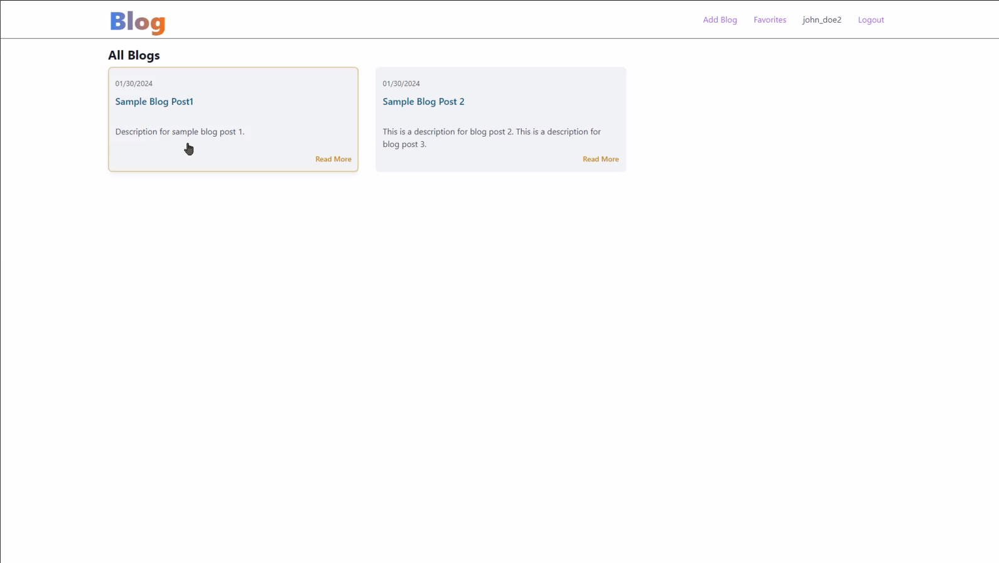

## Backend

Used express js as the backend or as REST API framework with SQLite3 for the database.

**Features**

1.  CRUD operations for blogs, users and comments.

## Front-End

Used React JS and Parcel as the bundler.

**Features**

1.  Add and update blogs.
2.  Add blogs as favorite blogs.
3.  Add and remove comments

## Guide

**Install packages**

1.  Install root package

```
npm install
```

2.  Install sub packages

```
npm run package
```

**Start the project**

```
npm start
```

**To access backend data table**

```
http://127.0.0.1:5432
```

**To access frontend**

```
http://127.0.0.1:1234
```

### Additionals

Added a video, to easily understand how this project work.

[](./doodle-inc-test.mkv)
